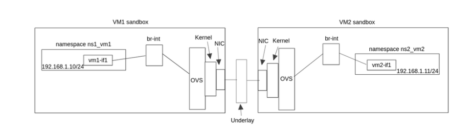


- Open vSwitch (OVS) é um projeto open source para interconectar VMS/containers via L2 (MAC) ou L3 (IP) em um mesmo host ou entre diferentes hosts. 

- Os principais componentes do OVS são:
	1. `ovsdb-server`: Mantém o banco de dados que contém as configurações do OVS (OVSDB). O banco guarda informações como bridges existentes, tipos de interfaces, configurações das bridges e mais. É gerenciado diretamente pelas tools:
		a. `ovs-vsctl`: Ferramenta de alto nível para configuração administrativa do OVS. É responsável por configurar o OVS através do banco de dados, por exemplo, alterar o OVSDB quando é criado uma bridge.
		b. `ovsdb-client`: Ferramenta mais baixo nível, que pode ser usada para consultas e manipulações mais genéricas do OVSDB.

	2. `ovs-vswitchd`: Daemon principal do OVS,  executado em userspace e é responsável principalmente por processar todos os flows e repassar para o Kernel. É quem efetivamente implementa o switch, e para interagir diretamente com ele existem essas tools:
		a. `ovs-ofctl`: Ferramenta de consulta e gerenciamento do OpenFlow. Permite manipular os flows de uma bridge.
		b. `ovs-dpctl`: Ferramenta de consulta e gerenciamento do Datapath, que é a parte responsável pelo encaminhamento dos pacotes, executado no Kernel.
		c. `ovs-appctl`: Ferramenta de controle e diagnóstico dos daemons do OVS, permitindo enviar comandos diretamente para processos como `ovs-vswitchd`.

	3. **Kernel Datapath module**: Responsável em realizar o forward dos pacotes e possui grande performance por executar o processamento dos flows (Physical flows) diretamente no nível do Kernel.
	
- Um flow descreve como o Datapath deve manipular os pacotes de um tipo no formato de **actions**. Tipos de actions incluem encaminhar o pacote para outra porta, output, modify vlan tag e mais. O processo de encontrar um flow para um pacote é chamado de **flow matching**: Os flows cacheados no Datapath do Kernel são chamados de **fast path**, já os que precisam da consulta do ovs-vswitchd são chamados de **slow path**.[

- Analisando o comando:
> `ovs-vsctl add-port mybridge vm1-if1 -- set interface vm1-if1 type=internal`
   
   É possível perceber distinções presentes no OVS:
	1. **Bridge**: Atua como um switch virtual. É onde são criadas portas e onde se conectam interfaces.
	2. **Port**: É o ponto de conexão com a bridge. É através dessas portas que a bridge consegue encaminhar os frames entre os diferentes elementos conectados nela.
	3. **Interface**: É o dispositivo de rede propriamente dito que está associado àquela porta. O kernel a vê como uma netdev normal, já o datapath vê como vport.. A interface pode ser outras coisas, como:
		a. Interface física (`eth0`)
		b. TAP/VETH
		c. Interface interna criada pelo próprio OVS (`type=internal`)	

> IMPORTANTE: O fluxo de um pacote passando que utiliza OVS é: 
> `OVS -> Kernel Linux -> Driver da NIC -> NIC -> Cabo/meio físico` (fazendo o caminho inverso para o host de destino).

